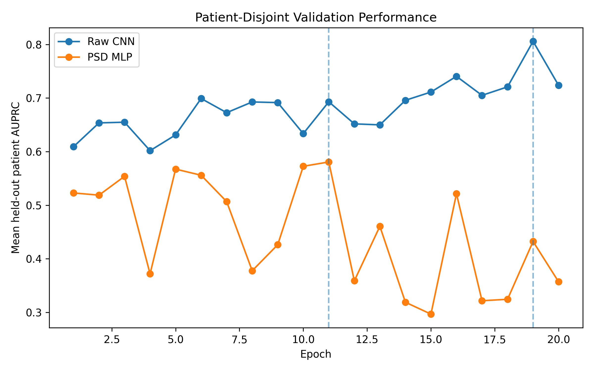
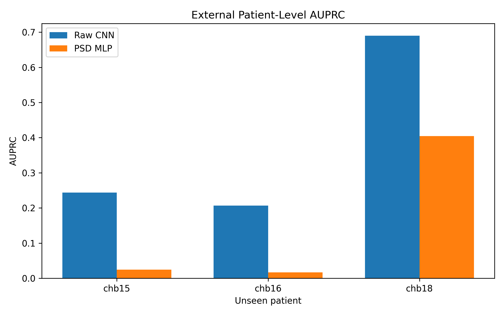
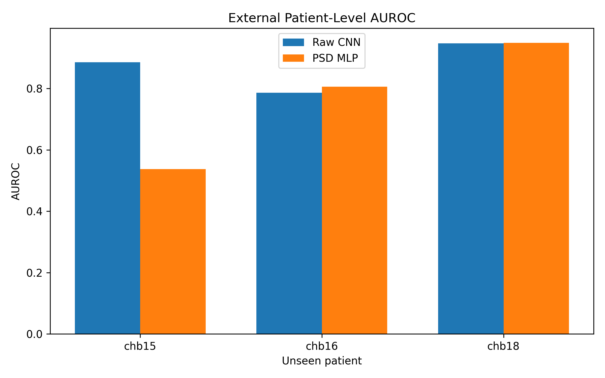

# Patient-Independent EEG Seizure Classification

**Python · PyTorch · MNE · SciPy · scikit-learn · NumPy · Pandas · Matplotlib**

I wanted to answer a pretty simple question: **if a seizure classification model performs well on EEG from patients it has already seen, does it still work on a completely new patient?**

This project compares two representations of scalp EEG for patient-independent seizure classification:

- **Raw multichannel EEG**, learned directly with a 1D CNN
- **Spectral bandpower features**, modeled with an MLP

Using the[CHB-MIT Scalp EEG Database](https://physionet.org/content/chbmit/1.0.0/), I built the preprocessing, feature extraction, model training, patient-disjoint validation, and evaluation pipeline from end to end.

The main focus is **generalization across patients**. Rather than randomly splitting EEG windows, patients are kept separate between training and evaluation so the models are tested on people they have not seen during training.


## Key Results

| Evaluation | Metric | Raw EEG CNN | PSD MLP |
|---|---|---:|---:|
| 18-patient LOSO baseline | Median AUROC | **0.981** | 0.959 |
| 18-patient LOSO baseline | Median AUPRC | **0.614** | 0.399 |
| Additional held-out patients | Macro AUROC | **0.873** | 0.764 |
| Additional held-out patients | Macro AUPRC | **0.380** | 0.148 |

After patient-disjoint model selection and retraining, the Raw CNN achieved higher **AUPRC on all three additional held-out patients**.

The broader 18-patient LOSO experiment also showed stronger descriptive performance for raw EEG, although the paired difference between representations was **not statistically significant at α = 0.05**.

Overall, the results are consistent with the raw waveform preserving useful temporal information that is not fully retained when the signal is compressed into five-band spectral features.


## What I Built

This project includes the full experimental pipeline rather than just the model definitions.

- Processed multichannel EEG from CHB-MIT EDF recordings
- Applied **0.5–50 Hz filtering** and a fixed 18-channel montage
- Extracted seizure-aware **4-second windows**
- Removed ambiguous windows close to seizure boundaries
- Built both raw waveform and spectral bandpower representations
- Implemented a **1D CNN** for raw EEG
- Implemented an **MLP** for 90-dimensional PSD features
- Kept training, validation, and evaluation patients disjoint
- Fit normalization statistics using training patients only
- Used class-weighted binary cross-entropy for severe class imbalance
- Built a memory-efficient two-pass pipeline for large raw EEG arrays
- Selected training duration using **patient-level AUPRC**
- Evaluated AUROC and AUPRC separately for each held-out patient
- Performed paired patient-level statistical testing for the LOSO experiment


## Model Overview

### Raw EEG

Each input window contains 4 seconds of EEG from 18 channels sampled at 256 Hz:

```text
18 channels × 1,024 samples
```

The waveform is passed directly into a 1D CNN:

```text
18 × 1,024
     ↓
Conv1D 18 → 32
ReLU
MaxPool
     ↓
Conv1D 32 → 64
ReLU
MaxPool
     ↓
Conv1D 64 → 128
ReLU
     ↓
Adaptive Average Pooling
     ↓
Dropout
     ↓
128 → 1
```

This allows the network to learn temporal signal patterns directly from the EEG waveform.


### Spectral Bandpower

For the second representation, I calculate Welch power spectral density and integrate power across five EEG frequency bands:

- Delta: 1–4 Hz
- Theta: 4–8 Hz
- Alpha: 8–12 Hz
- Beta: 12–30 Hz
- Gamma: 30–50 Hz

With 18 channels and 5 bands per channel, each EEG window becomes a **90-dimensional log-bandpower vector**.

```text
18 channels × 5 bands
        ↓
90 features
        ↓
90 → 64 → 32 → 1
       MLP
```


## Experiment 1 — 18-Patient LOSO Baseline

The first experiment uses **leave-one-subject-out evaluation** across 18 patients.

For each fold:

1. One patient is held out completely.
2. The other 17 patients are used for training.
3. Normalization statistics and class weights are calculated using training patients only.
4. RAW and PSD models each train for one epoch.
5. AUROC and AUPRC are calculated on the held-out patient.

This produces paired RAW and PSD results for the same 18 patients.

### LOSO Results

| Metric | Raw EEG | PSD |
|---|---:|---:|
| Median AUROC | **0.981** | 0.959 |
| Median AUPRC | **0.614** | 0.399 |

PSD produced higher AUROC for 7 of 18 patients and higher AUPRC for 7 of 18 patients, showing substantial variation between patients.

I also tested the paired patient-level differences statistically:

| Test | AUROC p-value | AUPRC p-value |
|---|---:|---:|
| Wilcoxon signed-rank | 0.417 | 0.167 |
| Exact paired sign-flip | 0.382 | 0.064 |

Neither test reached the **0.05 significance threshold**.

Because both models train for only one epoch in this experiment, I treat it as a broad patient-level baseline rather than a comparison of fully optimized models.


## Experiment 2 — Patient-Disjoint Model Selection

The second experiment uses a more developed model-selection procedure.

The same 18 development patients are divided into:

```text
14 training patients
4 validation patients
```

The split is fixed and identical for RAW and PSD.

Each model trains for up to 20 epochs. After every epoch, AUPRC is calculated separately for each validation patient, and the selected epoch is the one with the highest **mean patient-level AUPRC**.

AUPRC is used for selection because seizure windows are rare relative to normal EEG windows.

### Validation Performance



The selected training durations were:

```text
Raw CNN: 19 epochs
PSD MLP: 11 epochs
```

Both models are then **reinitialized from scratch** and retrained using all 18 development patients.

The full development cohort contains:

```text
52,271 EEG windows

660 seizure windows
51,611 normal windows

~78:1 normal-to-seizure ratio
```


## Additional Held-Out Patient Evaluation

The final models are evaluated on three additional CHB-MIT patients excluded from model selection and final training.

| Patient | Windows | Seizure Windows | RAW AUROC | RAW AUPRC | PSD AUROC | PSD AUPRC |
|---|---:|---:|---:|---:|---:|---:|
| chb15 | 1,736 | 39 | **0.886** | **0.244** | 0.538 | 0.024 |
| chb16 | 1,737 | 5 | 0.787 | **0.207** | **0.806** | 0.017 |
| chb18 | 1,738 | 21 | 0.948 | **0.690** | **0.949** | 0.404 |

### Patient-Level AUPRC



RAW achieved higher AUPRC on **all three held-out patients**.

### Patient-Level AUROC



AUROC was less consistent across patients. RAW performed substantially better on `chb15`, while PSD was slightly higher on `chb16` and `chb18`.

### Macro Results

| Model | Macro AUROC | Macro AUPRC |
|---|---:|---:|
| Raw CNN | **0.873** | **0.380** |
| PSD MLP | 0.764 | 0.148 |

The patient-level variation is why I report individual patient performance rather than relying only on one pooled score.


## Why Patient-Independent Evaluation Matters

EEG from the same patient can contain strong patient-specific characteristics.

If individual EEG windows are randomly divided between training and testing, windows from the same person can appear on both sides of the split. A model may then perform well partly because it has already learned characteristics of that patient.

For this project, the patient is therefore the main unit of separation:

- evaluation patients do not appear in training
- validation-patient data do not contribute to normalization statistics
- class weights are calculated using training labels only
- model selection is based on held-out patient performance
- final results are reported at the patient level


## Memory-Efficient Training

Raw EEG gets large quickly.

Each 4-second window contains:

```text
18 × 1,024 = 18,432 values
```

and the final development dataset contains more than 52,000 windows.

Instead of repeatedly concatenating large patient arrays, I use a **two-pass construction process**:

1. Scan the selected training patients to calculate normalization statistics and determine the final array size.
2. Allocate the final array once, fill it patient-by-patient, and normalize it in place.

This avoids unnecessary multi-gigabyte temporary copies while still allowing the models to train on all eligible windows at their natural prevalence.


## Repository Structure

```text
.
├── README.md
├── 01_loso_baseline.ipynb
├── 02_patient_disjoint_model_selection.ipynb
│
└── figures/
    ├── validation_auprc_by_epoch.png
    ├── heldout_patient_auprc.png
    └── heldout_patient_auroc.png
```

### `01_loso_baseline.ipynb`

Contains:

- 18-patient leave-one-subject-out evaluation
- Raw CNN and PSD MLP training
- per-patient AUROC and AUPRC
- paired Wilcoxon signed-rank testing
- exact paired sign-flip testing
- interpretation and limitations

### `02_patient_disjoint_model_selection.ipynb`

Contains:

- fixed 14/4 patient-disjoint development split
- multi-epoch model selection
- patient-level AUPRC validation
- full-development model retraining
- memory-efficient raw EEG processing
- additional held-out patient preprocessing
- final RAW vs PSD evaluation
- validation and patient-level performance figures


## Tech Stack

**Deep Learning:** PyTorch, CUDA

**EEG / Signal Processing:** MNE, SciPy, Welch PSD

**Machine Learning / Evaluation:** scikit-learn, AUROC, AUPRC, patient-level validation, paired statistical testing

**Data / Visualization:** NumPy, Pandas, Matplotlib


## Limitations

- Experiment 1 trains both models for only one epoch.
- Experiment 2 uses one fixed 14/4 development split rather than nested patient-level cross-validation.
- The final held-out evaluation includes only three patients, so those results are descriptive rather than a basis for statistical inference.
- The additional held-out patients are still from CHB-MIT rather than an independent clinical dataset.
- Only a subset of available recordings are used.
- RAW and PSD use different architectures because their input representations have fundamentally different structures.
- The additional held-out patients had been inspected during earlier project iterations, so they should not be treated as a pristine confirmatory test set.

The conclusions are therefore specific to this experimental setup rather than evidence that raw EEG is universally superior or that either model is clinically validated.


## Future Work

The next experiments I would run are:

- repeat model selection across multiple patient-disjoint splits
- evaluate on a larger held-out patient cohort
- test an independently collected EEG dataset
- compare spectrogram or other time-frequency representations
- explore architectures that combine temporal and spectral information
- analyze which patients or seizure characteristics drive the largest representation differences


## Takeaway

The main thing I took away from this project is that strong aggregate performance does not automatically mean strong patient-independent performance.

The representation comparison also was not completely uniform across patients. RAW showed stronger overall precision-recall performance, especially after patient-disjoint model selection, but PSD still performed better for some individual patient/metric combinations.

Under this setup, **raw EEG retained substantially stronger precision-recall performance than the compressed five-band spectral representation on the additional held-out patients**, while the broader LOSO experiment showed substantial patient variability and did not establish a statistically significant representation difference.
